## **Step By Step Process**

### ETL in SQL (Big Query)

**Extraction and Importing:** Extracted data from [Airbnb](http://insideairbnb.com/get-the-data/), imported into BigQuery, and assessed loaded data.

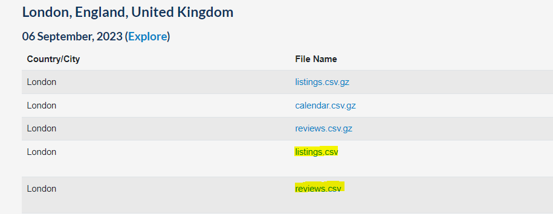

*Fig 1. Data sourced from Airbnb*

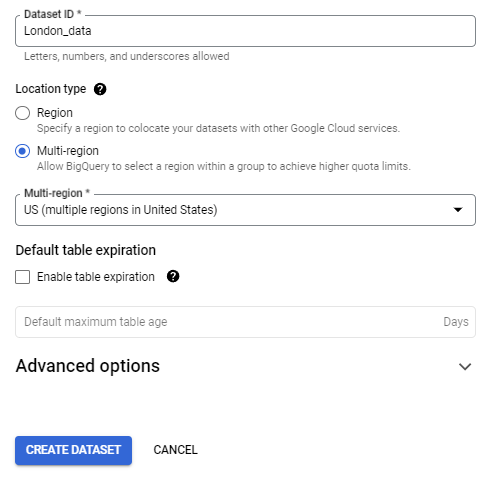

*Fig 2. Creating Data warehouse*

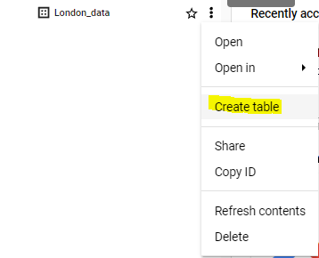

*Fig 3. Importing tables*

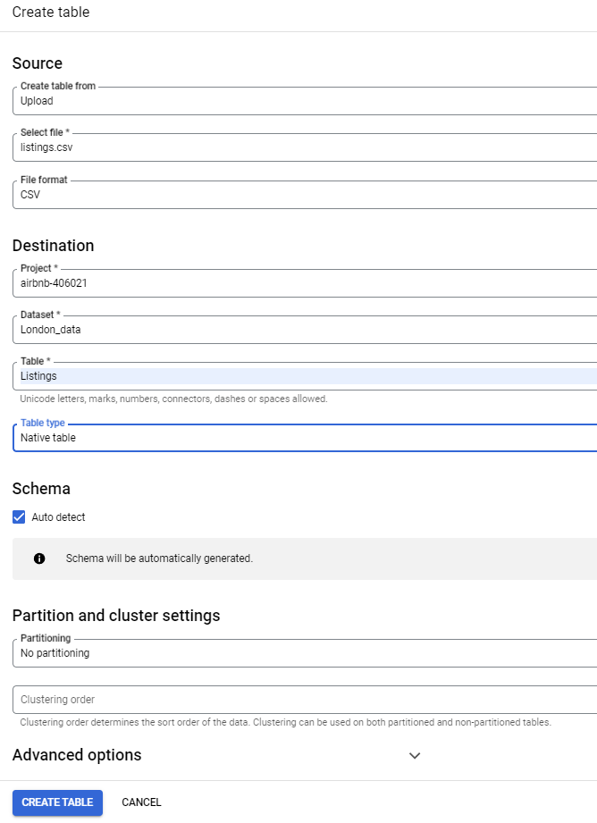

*Fig 4. Configuration for data import*

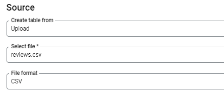

*Fig 5. Import of 2nd data table*

**Handling Missing Values:** Identified missing data in 2 Columns: "last_review" & "reviews_per_month"; used JOIN functions to populate missing data. Cross-referenced with new column "latest_reviews_date" to verify its accuracy

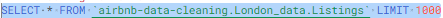

*Fig 6. Query 1* 

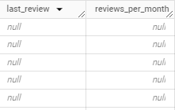

*Fig 7. Excerpt from Query 1*

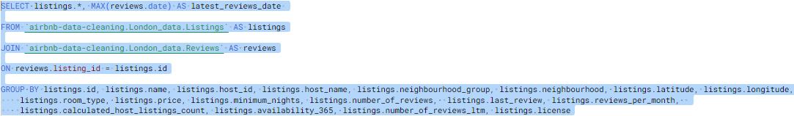

*Fig 8. Query 2* 

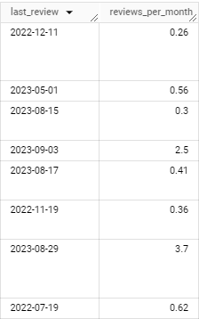 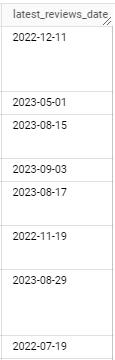

*Fig 9. Excerpt from Query 2*

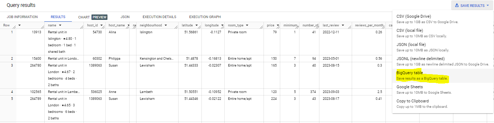

*Fig 10. Exported Query 2 results as a new table named "populated_listings"*

**Column Transformation:** Split condensed information in the 'name' column into separate values.

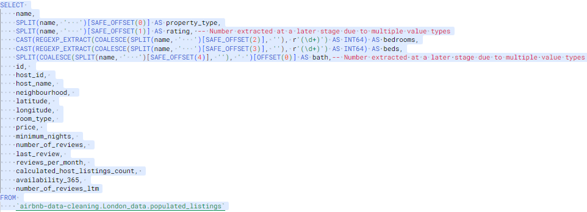

*Fig 11. Query 3* 

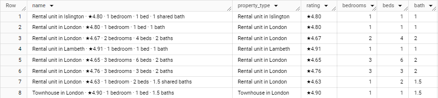

*Fig 12. Excerpt from Query 3*

**Data quality check:** Upon reviewing the new table, inconsistencies emerged in extracting numeric values. Problem arose from the multiple formats of the "name" column 

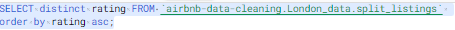

*Fig 11. Query 4*

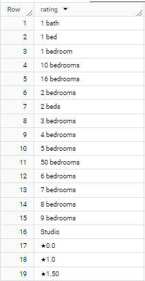

*Fig 12. Excerpt from Query 4*

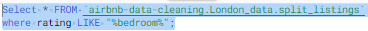

*Fig 13. Query 5*

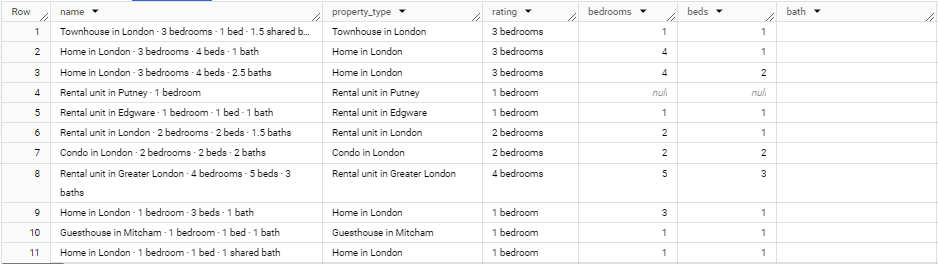

*Fig 14. Excerpt from Query 5*

**Data format solution:** Resolved data formatting issues by employing REGEXP functions to accurately detect numerical values preceding specified raw string words

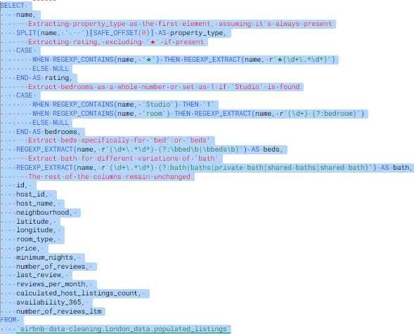

*Fig 15. Query 6*

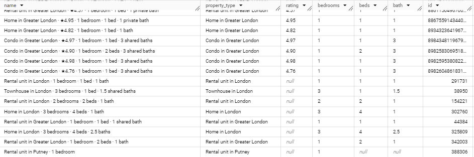

*Fig 16. Excerpt from Query 6*

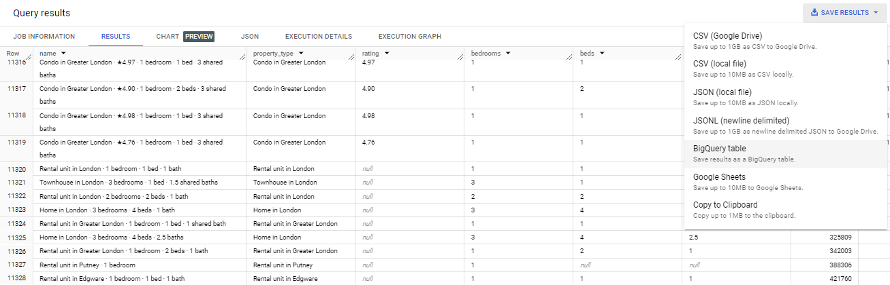

*Fig 17. Exported Query 6 results as a new table named "split_listings_v2"*

**Converting data types:** Finally I converted the data type of the split columns into INT64 for whole numbers & FlOAT64 for decimals and exported the results as "cleaned_listings" ready for analysis

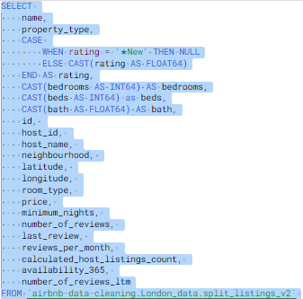

*Fig 18. Query 7*

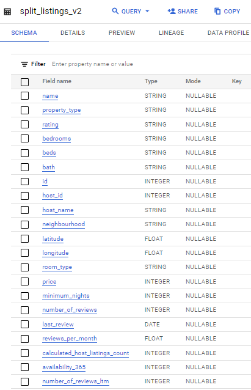 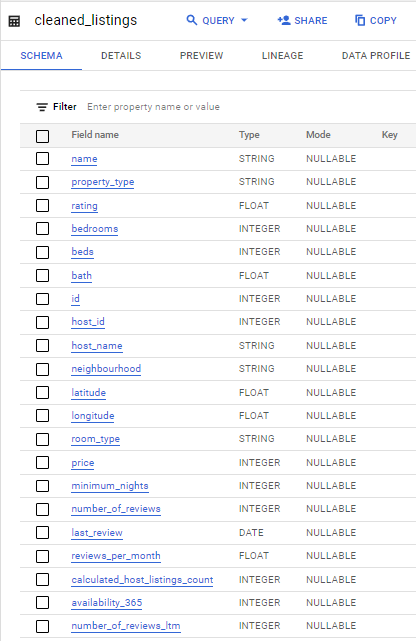 

*Fig 19. Cross referenced schema of "split_listings_v2" and "cleaned_listings"*

### Visualization with R

**Package Installation:** Installed and loaded necessary R packages for data manipulation and visualization.

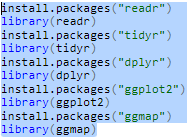

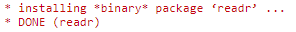 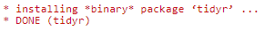 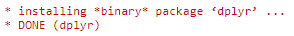 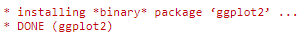 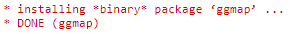 

**Importing Data:** Imported cleaned data into R studio 

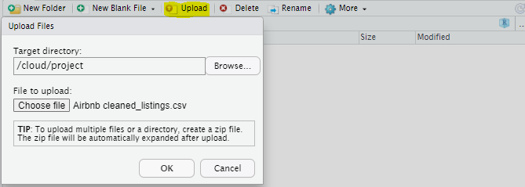

**Data Manipulation:** Summarized key insights about total reviews, average price, and availability based on room types and neighborhoods.

**Visual Exploration:** Created visualizations depicting relationships between variables such as room type and reviews, price vs. rating, geographical distribution of listings, etc.

**Geographical Mapping:** Utilized Google Maps API to plot the location of Airbnb listings on a map of London.
