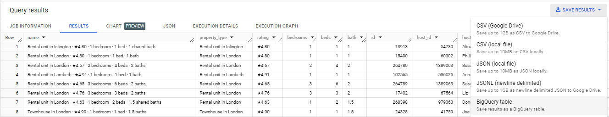

## **Step By Step Process**

### ETL in SQL (Big Query)

**Extraction and Importing:** Extracted data from [Airbnb](http://insideairbnb.com/get-the-data/), imported into BigQuery, and assessed loaded data.

*Fig 1. Data sourced from Airbnb*

*Fig 2. Creating Data warehouse*

*Fig 3. Importing tables*

*Fig 4. Configuration for data import*

*Fig 5. Import of 2nd data table*

**Handling Missing Values:** Identified missing data in 2 Columns: "last_review" & "reviews_per_month"; used JOIN functions to populate missing data. Validated against new column "latest_reviews_date"

*Fig 6. Query 1* 

*Fig 7. Excerpt from Query 1*

*Fig 8. Query 2* 

 

*Fig 9. Excerpt from Query 2*

*Fig 10. Exported Query 2 results as a new table named "populated_listings"*

**Column Transformation:** Split condensed information in the 'name' column into separate values.

*Fig 11. Query 3* 

*Fig 12. Excerpt from Query 3*

*Fig 10. Exported Query 3 results as a new table named "split_listings"*

**Data quality check:** Upon reviewing the new table, inconsistencies emerged in extracting numeric values.  

*Fig 11. Query 4*

*Fig 12. Excerpt from Query 4*

*Fig 13. Query 5*

*Fig 14. Excerpt from Query 5*

### Visualization with R

**Package Installation:** Installed necessary R packages for data manipulation and visualization.

**Data Manipulation:** Filtered outliers, summarized key insights about total reviews, average price, and availability based on room types and neighborhoods.

**Visual Exploration:** Created visualizations depicting relationships between variables such as room type and reviews, price vs. rating, geographical distribution of listings, etc.

**Geographical Mapping:** Utilized Google Maps API to plot the location of Airbnb listings on a map of London.
