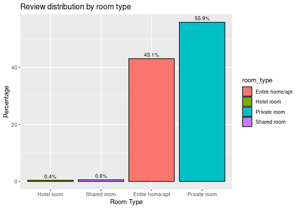
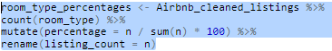
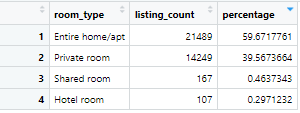
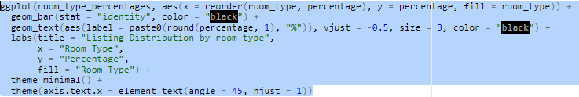
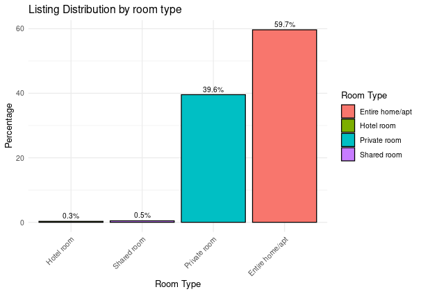

## Analysis & Visualisation
This is the data analysis of Airbnb listings in the London area

  
**Click to show code chunk and aggregated data**

  

 

The visulisation shows that Entire Home/apt and Private rooms make up for most of the reviews in London with Private rooms having the highest proportion of reviews

  
**Click to show code chunk and aggregated data**

The most notable observation when comparing the visualisations above shows that even though the private room makes up for ~40% of listings, it accounts for 56% of the total reviews. This disparity could suggest a higher level of satisfaction from guests through the level of service they receive, or even by an overrepresentation of reviews received from more vocal/engaged guests. Causal analysis is an option to test the thesis, however, strict conditions need to be met for a valid analysis. 
